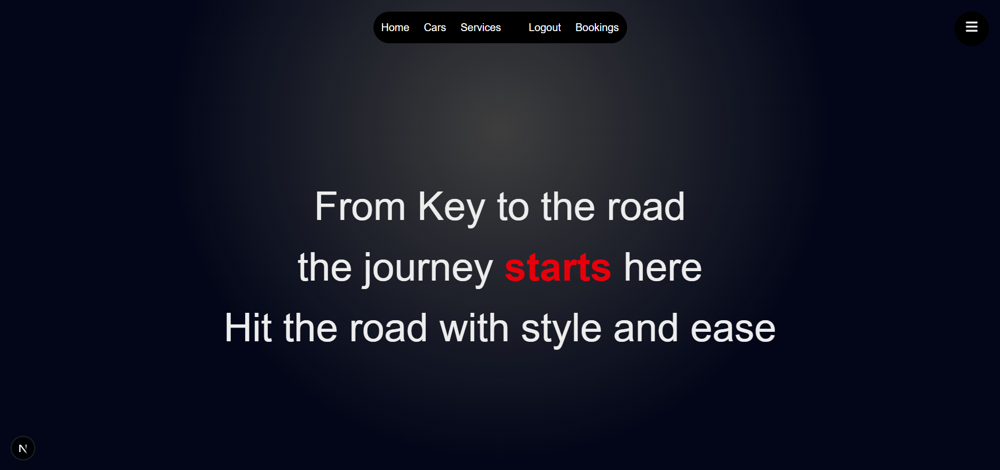
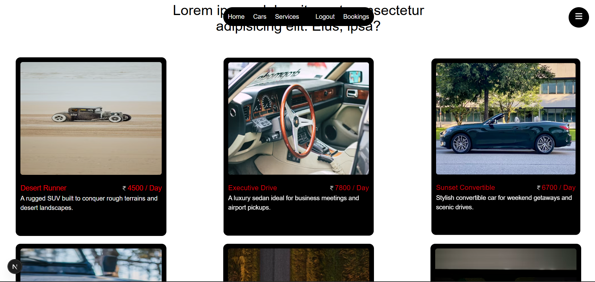
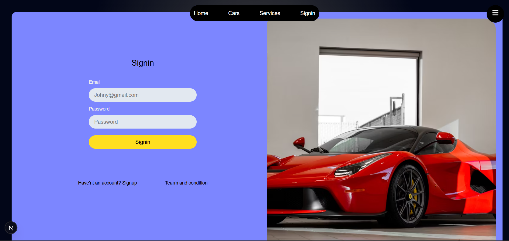
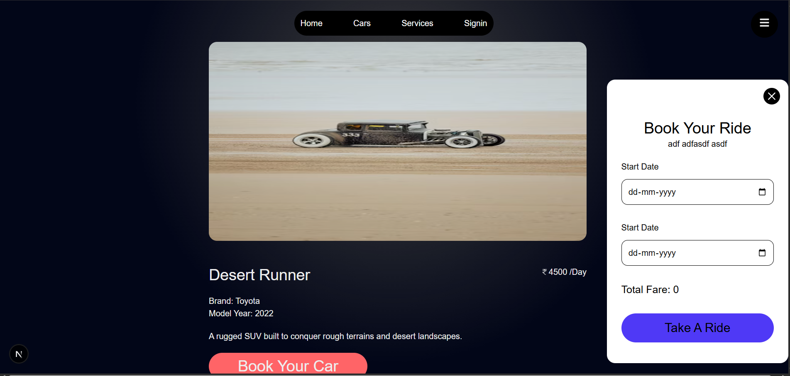
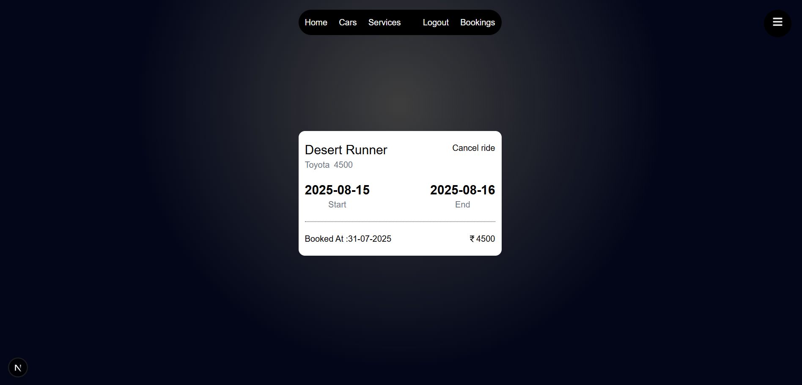

# 🚗 Car Rental Application

A modern, full-stack car rental platform built with **Next.js**, **PostgreSQL**, **Prisma**, and **NextAuth**.  
Users can browse, book, and manage car rentals in real time, while admins can add, edit, or remove cars.

---

## 🌐 Live Demo
🔗 [View Live Project](https://car-rental-virid-phi.vercel.app)

---

## 📸 Screenshots

### Homepage


### Cars


### Login Page


### Booking page


### Bookings



### Admin Dashboard


---

## 📋 Features

- 🔐 **User Authentication** with **NextAuth** (Google & Email login)
- 📅 **Real-time Booking System** with Prisma & PostgreSQL
- 💳 **Dynamic Pricing** based on rental duration
- 📱 Fully Responsive with **Tailwind CSS**
- 🔄 **Admin Dashboard** to manage cars and bookings
- ✨ Smooth animations with **Framer Motion**
- 🔔 Toast notifications via **React Hot Toast**

---

## 🛠️ Tech Stack
**Frontend:** Next.js, Tailwind CSS, Framer Motion, React Icons  
**Backend:** Next.js API Routes, Prisma ORM  
**Database:** PostgreSQL  
**Auth:** NextAuth  
**Security:** Bcrypt for password hashing  
**Notifications:** React Hot Toast

---

## 📦 Installation

### 1️⃣ Clone the repository
```bash
git clone https://github.com/warsi0707/car-rental

npm install

npx prisma migrate dev --name init

npm run dev
```

